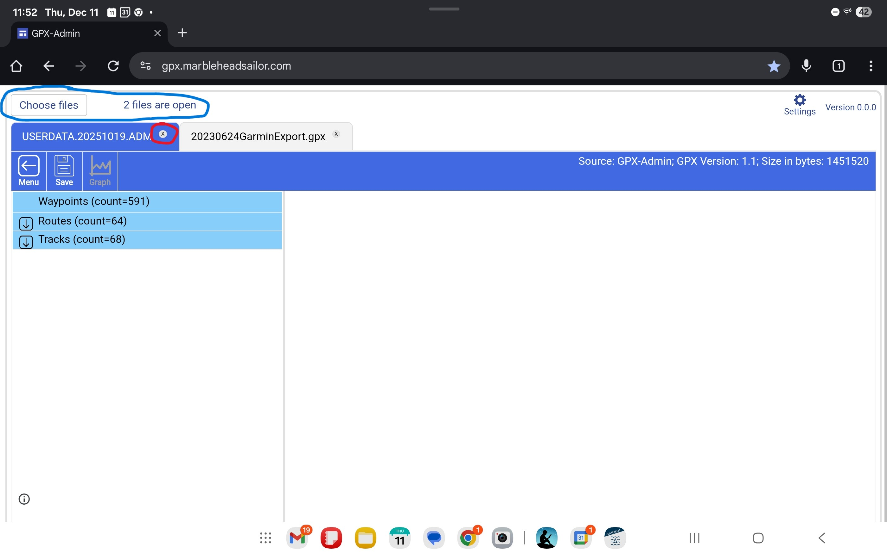
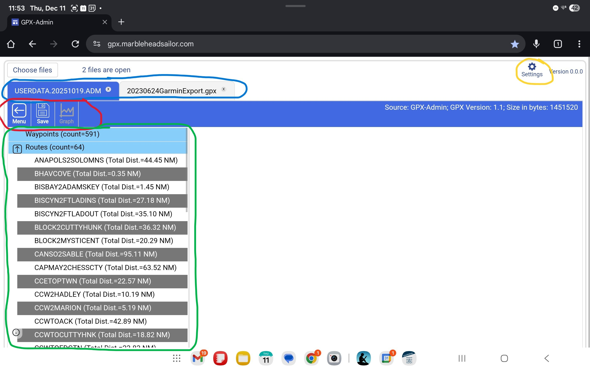
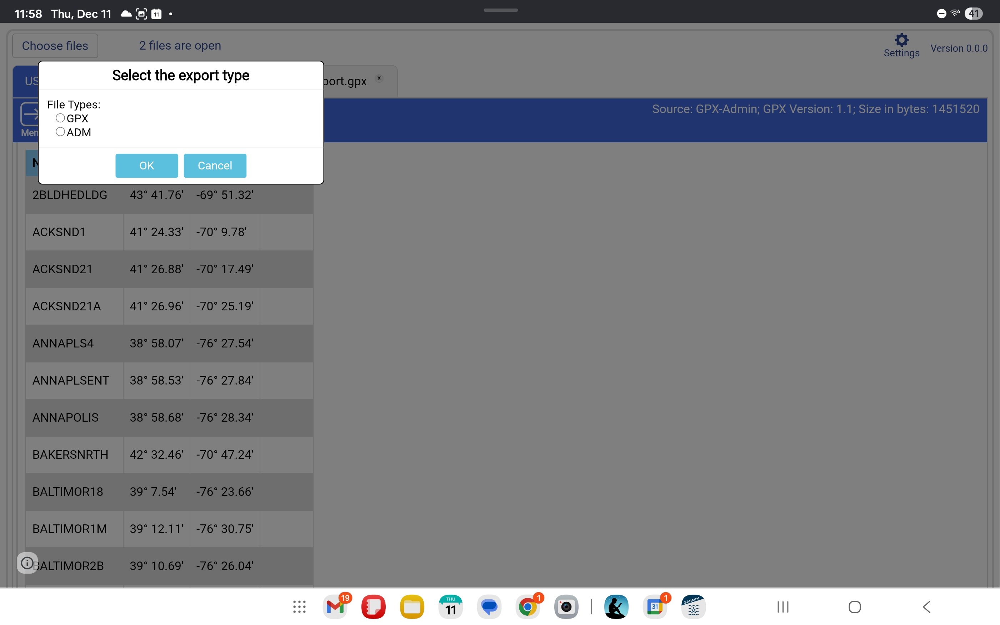
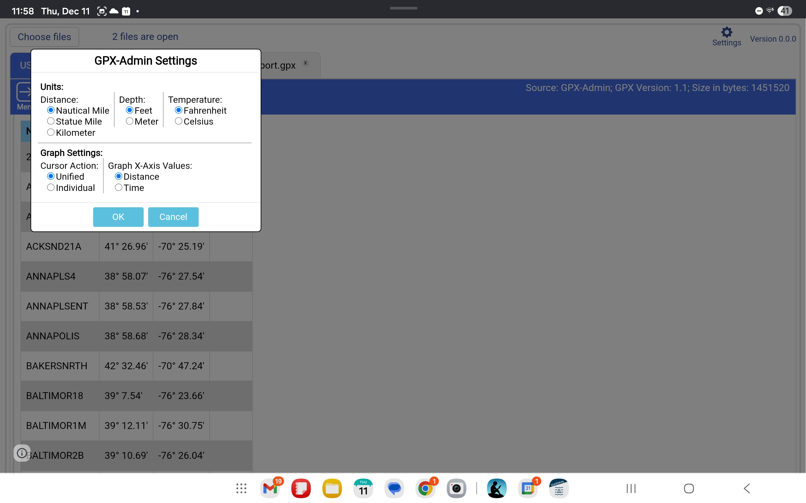
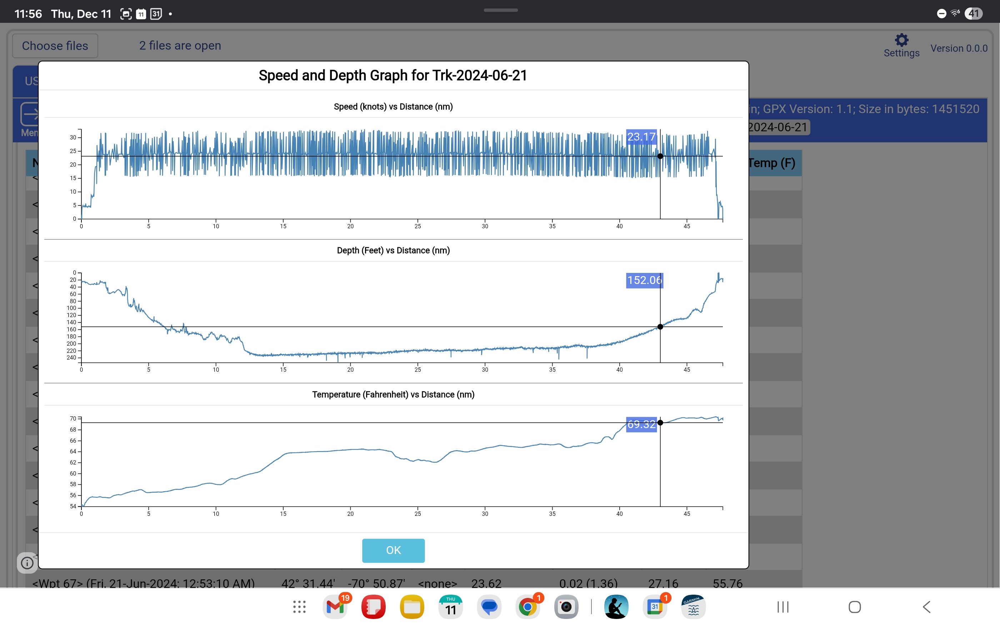
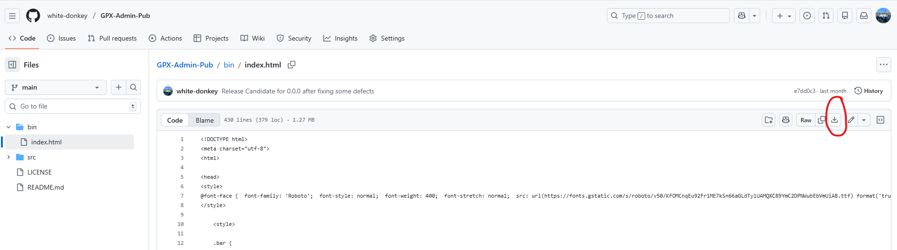

# GPX-Admin Publish (Current version: 0.0.0 - Released 09-Dec-2025)
This is a reference repository for the released versions of GPX-Admin.  This repository is not intended for development even though it contains the full source.  The source is included for transparency into the application.

To use the Web application please click here: [Google Sites GPX-Admin](https://gpx.marbleheadsailor.com) for the online version (internet connectivity required) or refer to the instructions in section [2.6 Offline use](#2.6-offline-use) for how to use the application while offline.

[TOC]

## 1. Introduction
GPX-Admin was created to convert GPX files to the Garmin binary ADM format used to import routes, waypoints and tracks into Garmin's legacy chartplotters like the popular GPSMap 72XX series.  I prefer to do my route planning using both Navionics and AquaMaps which will only export GPX files so I needed a way to convert the GPX files to ADM.  Garmin did create an application called HomePort to do this conversion (as well as other things) but they no longer support it and have removed any download links to get this application.  Also, HomePort will only run on a laptop, not on a tablet.  If you had not already downloaded the HomePort application and have one of Garmin's legacy chartplotters you would be forced to do all route planning directly on the chartplotter itself.  GPX-Admin avoids this forced use of the chartplotter for planning.
## 2. Usage
### 2.1 Opening and Closing files
To open files click the "Choose files" button in the upper left corner of the display.  This button is circled in blue in the screen shot below.  After clicking the button a standard file selection dialog will open.  The dialog will be different depending on which operating system your browser is running in.  The total number of files currently open is displayed to the right of the Choose files button.

To close a file click the "x" located in the upper right of the file's tab.  This "x" is circled in red in the screen shot below.

The following file types are supported for opening.
* GPX - A text file that follows the [GPX schema](https://www.topografix.com/gpx/1/1/).  This is the current standard used across navigation applications.
* ADM - A binary file that is only supported by legacy Garmin chart plotters and the no longer supported, Windows only, Garmin HomePort application.
* JSON - A text JSON (JavaScript Object Notation) file formatted to the model used by the MarineTraffic website.  This format is likely not useful for most users.  The expected format of the objects in this file are specific to an export of AIS track data from the MarineTraffic website.  MarineTraffic does not support export of this data, at least not in the free tier of their product.

### 2.2 Navigation within the application
* The tabs across the top (circled in blue in the screenshot below) allow you to switch between multiple opened files.
* The Menu button in the toolbar (circled in red in the screenshot below) will expand/collapse the side menu (circled in green in the screenshot below) that lists Waypoints, Routes and Tracks.
* The Save button in the toolbar (circled in red in the screenshot below) will open a dialog to save the file to a disk.  See [2.3 Saving files](#2.3-saving-files) for more information.
* The Graph button in the toolbar (circled in red in the screenshot below) will open a dialog to display graphs of speed, depth and water temperature.  See [2.5 Using the graph](#2.5-using-the-graph) for more information.
* Clicking the Waypoints menu will display the waypoints contained in the file as a table in the data area.
* Clicking the Routes menu will expand the menu to list all the routes contained in the file.  Clicking one of these routes will display the route data as a table in the data area.
* Clicking the Tracks menu will expand the menu to list all the tracks contained in the file.  Clicking one of these routes will display the track data as a table in the data area.
* Clicking the Settings gear icon (circled in yellow in the screenshot below) will open a dialog box that allows you to set application wide preferences.  See [2.4 Settings](#2.4-settings) for more information.
* When displaying a route or a track in the data area the name of the route or track will be displayed in the far right side of the toolbar underneath the file information. 
* When displaying a route or a track in the data area you will notice that the distance column will show a number and a second number in parentheses.  The first number is the distance from the last point.  The number in the parentheses is the cumulative distance of the route or track at that point.

### 2.3 Saving files
GPX-Admin can save files to a local storage.  It can output either GPX or ADM formatted files.  The file that will be saved is the currently active tab.  To save a file:
1. Click the Save button in the toolbar
2. A dialog will open asking what file type to save.  See the screenshot below. 
3. After selecting the desired export type click the OK button.
4. After clicking the OK button a standard file save dialog will open.  The dialog will be different depending on which operating system your browser is running in.  Enter the name and location to save the file.

### 2.4 Settings
To change some of the behavior of the application a user can click the Settings gear icon in the upper right side of the application.  This will open a dialog (see the screenshot below) that allows the user to set their preferences.  If permissions of the browser/OS allow, the application will save the selected settings as browser cookies.  This is done so that the settings can be persisted across multiple sessions.  If permissions do not allow saving the cookie, the settings will revert to their default values for each session.

The settings that are available are:
* Units
    * Distance - Available values are; Nautical Mile with speed in knots (default), Statue Mile with speed in MPH or Kilometer with speed in KPH
    * Depth - Available values are; Feet (default) or Meter
    * Temperature - Available values are; Fahrenheit (default) or Celsius

* Graph Settings
    * Cursor Action - Determines if the cursors across all graphs will always be positioned in the same location on the horizontal axis or not.  The default is Unified.
    * Graph X-Axis Values - Sets the graph's X-Axis to be time based or distance based.  The default is Distance.

### 2.5 Using the graph
If the currently displayed data can be represented in a graph then the Graph button will be enabled.  The graph feature is only usable with track information since tracks are the only data objects in a GPX file that contain speed, depth and temperature.  Tracks are not required to contain these three bits of information.  If speed is not included it will be calculated based on timestamp and distance, so speed is always available for a track in GPX-Admin.  The graph will only display what is available.  This means, for example, that if the track does not include temperature data the temperature graph will not be rendered.

The graphs have cursors that can be used to see the value at specific locations in the graph.  To display the cursors a user needs to hover their cursor (when using a mouse) or to tap (touchscreen) to display them.  If the cursor setting is set to Unified all displayed graphs will show a cursor at the same horizontal location.  If the cursor setting is Individual then each graph will have its own separate cursor that can be moved independently.

### 2.6 Offline use
To use the application offline you must download onto the device (laptop or tablet) you wish to use it on.  The application has been minimized into a single HTML file that, once saved to your device, can be opened by your browser.  To download the file use this link:
[GPX-Admin as a single HTML file](https://github.com/white-donkey/GPX-Admin-Pub/blob/main/bin/index.html)
Which will open the file in GitHub's file viewer.  You can then click the Download File button (circled in red in the screenshot below) to save the file to your device.

Some caveats to offline use:
* If you change settings while using the online version and then download and run GPX-Admin offline from a local file, you will need to readjust the settings.  Browsers store cookies based on the URL of the page they are displaying and the URLs are different for the online version and the local file you run when offline.
* A downloaded file will **not** automatically update to the latest version.  If I release a new version to fix bugs or add features the online version will contain those changes.  To update your local copy you will need to re run the steps outlined above to download the new version.  If you overwrite your previously downloaded version any settings you changed will still be what you changed them to.  If you download to a new location or filename then you will need to readjust the settings because when you run it the browser will view it as a new URL.

## 3. Known issues
* Route distance in menu
The distance for a route displayed in the menu ignores the selected distance setting and will only display the length of the route in nautical miles.
* Track distance in menu
The distance for a track displayed in the menu ignores the selected distance setting and will only display the length of the track in nautical miles.
* Graph cursors on mobile devices
Dragging the graph cursors when used on a mobile device (tablet or phone) does not work smoothly.  Tapping to position the cursor and dragging a small distance is possible.
* Poor UI layout on small screens (i.e. phones)
The application was not designed to be reactive.  Due to this the UI is not well laid out or scaled when used on phone.  The application is best used on a tablet (in landscape orientation) or laptop.
* Not rendering waypoint symbols
The waypoint symbols that are associated with a waypoint do not get rendered in the tables.  They are still in the GPX file and are maintained in an export to another file.
* Time displayed in graphs
The time displayed for the ticks in the X-axis of the graphs is displayed as seconds instead of a formatted date/time.

